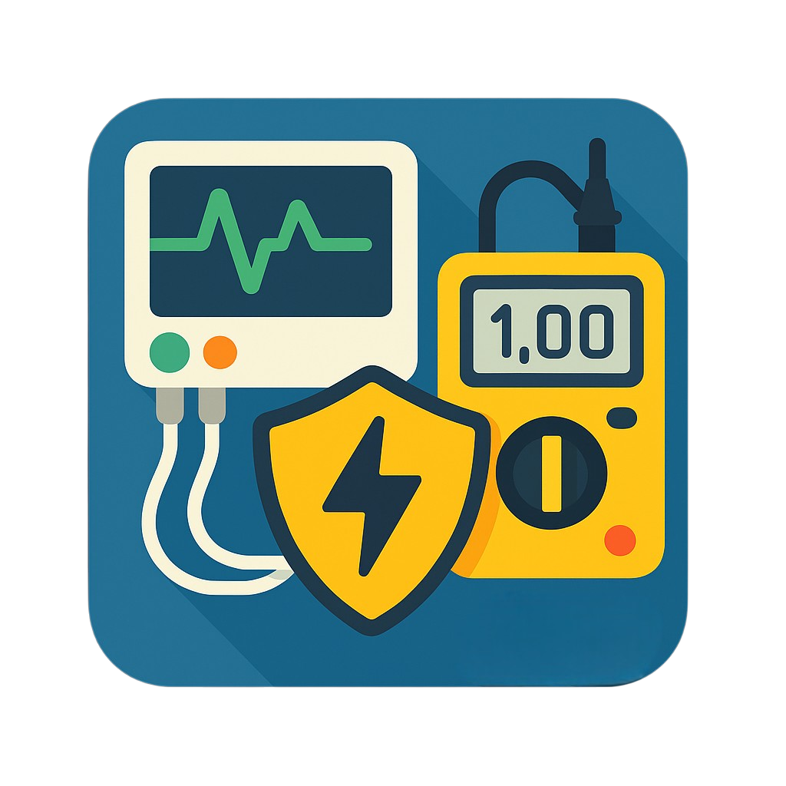

# ⚡ Safety Test Manager (STM)

[](https://www.gnu.org/licenses/gpl-3.0)
[](https://www.python.org/)
[-green.svg)](https://doc.qt.io/qtforpython-6/)

Software gestionale per **verifiche di sicurezza elettrica** e **verifiche funzionali** su dispositivi elettromedicali, conforme alle normative **CEI 62-5 (IEC 62353)**.



---

## 🏥 Funzionalità principali

- **Gestione anagrafica completa**: clienti, destinazioni, dispositivi medici
- **Verifiche elettriche** con strumentazione Fluke ESA612 (comunicazione seriale diretta)
- **Verifiche funzionali** con profili personalizzabili per tipologia di dispositivo
- **Generazione report PDF** conformi alle normative
- **Sincronizzazione client/server** con gestione conflitti
- **Scansione UDI/Barcode** con lookup automatico GUDID (FDA)
- **Integrazione scanner mobile** (app Android VScanner)
- **Audit log** completo di tutte le operazioni
- **Gestione multi-utente** con ruoli (admin, tecnico, segreteria)
- **Profili elettrici** predefiniti per Classe I/II, parti applicate B/BF/CF
- **Profili funzionali** per monitor multiparametrici, pompe, defibrillatori, ecc.

---

## 🛠️ Requisiti

- **Python** 3.10 o superiore
- **PostgreSQL** (per il server di sincronizzazione)
- **Windows** 10/11 (per comunicazione seriale con Fluke ESA612)

---

## 🚀 Installazione

### 1. Clona il repository

```bash
git clone https://github.com/YOUR_USERNAME/safety-test-manager.git
cd safety-test-manager
```

### 2. Crea un ambiente virtuale

```bash
python -m venv .venv
.venv\Scripts\activate    # Windows
```

### 3. Installa le dipendenze

```bash
pip install -r requirements.txt
```

### 4. Configurazione

Crea un file `config.ini` nella root del progetto:

```ini
[server]
url = http://localhost:8000

[updater]
url = https://your-version-check-url/version.json

[sync]
interval_minutes = 20
```

Crea un file `.env` con la chiave JWT:

```
SECRET_KEY=your-secret-key-here
```

### 5. Database server (opzionale, per sincronizzazione)

Crea il database PostgreSQL:

```bash
psql -U postgres -f online_database.sql
```

Avvia il server:

```bash
python real_server.py
```

### 6. Avvia l'applicazione

```bash
python main.py
```

---

## 📁 Struttura del progetto

```
├── main.py                  # Entry point dell'applicazione
├── database.py              # Database locale SQLite
├── real_server.py           # Server FastAPI per sincronizzazione
├── report_generator.py      # Generazione report PDF
├── online_database.sql      # Schema PostgreSQL per il server
├── requirements.txt         # Dipendenze Python
├── app/
│   ├── config.py            # Configurazione e costanti
│   ├── services.py          # Logica di business
│   ├── data_models.py       # Modelli dati
│   ├── auth_manager.py      # Gestione autenticazione
│   ├── sync_manager.py      # Sincronizzazione client/server
│   ├── hardware/            # Comunicazione strumenti (Fluke ESA612)
│   ├── ui/                  # Interfaccia grafica (PySide6)
│   │   ├── main_window.py   # Finestra principale
│   │   ├── widgets.py       # Widget personalizzati
│   │   └── dialogs/         # Finestre di dialogo
│   ├── utils/               # Utility (UDI lookup, ecc.)
│   └── workers/             # Thread worker per operazioni async
├── migrations/              # Migrazioni database SQLite
├── MODELLI VE/              # Profili verifiche elettriche (JSON)
├── MODELLI VFUN/            # Profili verifiche funzionali (JSON)
└── styles/                  # Temi e stili CSS
```

---

## 📋 Normative supportate

| Normativa | Descrizione |
|---|---|
| **CEI 62-5 (IEC 62353)** | Verifiche di sicurezza elettrica su apparecchi elettromedicali |
| **CEI EN 60601-1** | Requisiti generali sicurezza apparecchi elettromedicali |

---

## 🤝 Contribuire

I contributi sono benvenuti! Per contribuire:

1. Fai un **fork** del repository
2. Crea un **branch** per la tua feature (`git checkout -b feature/nuova-funzione`)
3. Fai **commit** delle modifiche (`git commit -m 'Aggiunta nuova funzione'`)
4. Fai **push** sul branch (`git push origin feature/nuova-funzione`)
5. Apri una **Pull Request**

---

## 📄 Licenza

Questo progetto è rilasciato sotto licenza **GNU General Public License v3.0**.

Vedi il file [LICENSE](LICENSE) per i dettagli completi.

```
Safety Test Manager - Software per verifiche di sicurezza elettrica
Copyright (C) 2026  Elson Meta

This program is free software: you can redistribute it and/or modify
it under the terms of the GNU General Public License as published by
the Free Software Foundation, either version 3 of the License, or
(at your option) any later version.
```

Questo software utilizza librerie di terze parti con licenze compatibili.
Consulta [THIRD_PARTY_LICENSES.txt](THIRD_PARTY_LICENSES.txt) per l'elenco completo.

---

## 📧 Contatti

**Elson Meta** — [GitHub](https://github.com/Sonimeta)
